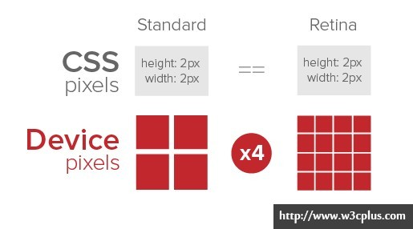
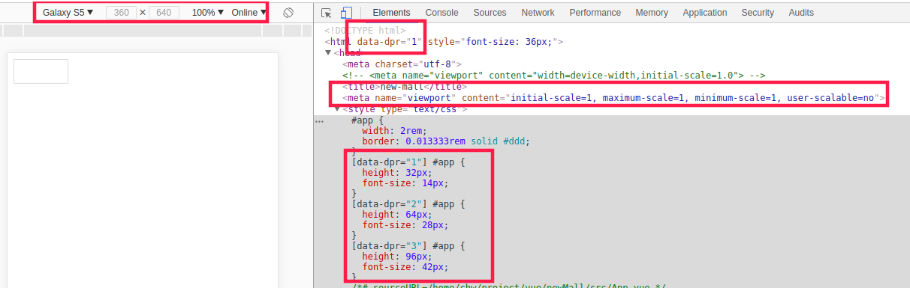
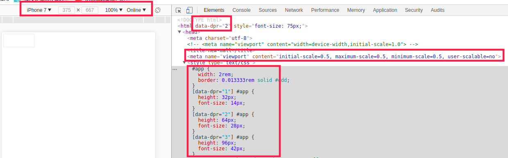
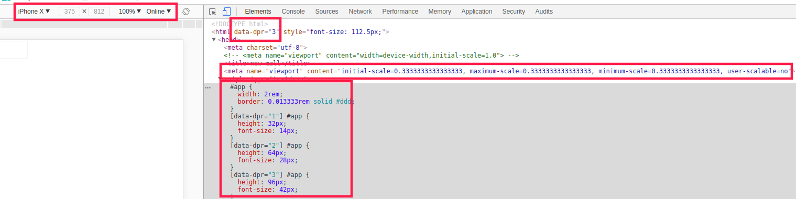

# 手淘适配模式

## 1、原理

### 1.1 视网膜原理

> + 维基百科：将Retina译为“视网膜”。"Retina"一词，原意是“视网膜”的意思，指显示屏的分辨率极高，使得肉眼无法分辨单个像素。
> + 苹果的“iPhone4”和"new iPad"以及“Macbook Pro”中已经使用了Retina(视网膜)技术。这是一种新的屏幕的显示技术。苹果表示，Retina屏幕是一种具备超高像素密度的液晶屏，它可以将960x640的分辨率压缩到一个3.5英寸的显示屏内。也就是说，该屏幕的像素密度达到326像素/英寸（ppi）。
> + 苹果采用Retina屏幕技术得到了更多人的亲眯，因为Retina给画面带来了前所未有的清晰平滑效果。相比之下，互联网非常的庞大，从当初的普通屏幕过渡到Retina是件缓慢而又痛苦的事情。在缺少行业标准来简化这个过程，每个Web开发人员和设计者为了确保他们的用户得到最好的视觉体验，Retina还是给他们带来了些小麻烦。
>
> 摘录于 [http://www.w3cplus.com/css/towards-retina-web.html]

### 1.2、相关知识

+ #### 设备像素：设备像素也被称为物理像素,他是显示设备中一个最微小的物理部件。每个像素可以根据操作系统设置自己的颜色和亮度。正是这些设备像素的微小距离欺骗了我们肉眼看到的图像效果。

+ #### 屏幕密度：屏幕密度是指一个设备表面上存在的像素数量，它通常以每英寸有多少像素来计算（PPI）。

+ #### CSS像素：CSS像素是一个抽象的单位，主要使用在浏览器上，用来精确的度量（确定）Web页面上的内容。一般情况下，CSS像素被称为与设备无关的像素（device-independent像素），简称为“DIPs”。在一个标准的显示密度下，一个CSS像素对应着一个设备像素。

### 1.3、视网膜模糊

```html
<div height="200" width="300"></div>
```

+ 上面的代码，将会在显示屏设备上绘制一个200x300像素的盒子。但是在Retina屏幕下，相同的div却使用了400x600设备像素，保持相同的物理尺寸显示，导致每个像素点实际上有4倍的普通像素点，如图所示：



+ 反过来说，一个CSS像素点实际分成了四个，这样就造成了颜色只能近似选取，于是，我们看上去就变得模糊了。那么在Web开发和设计中，我们可以通过"device-pixel-ratio"（设备像素比：dpr）来解决。

### 1.4、手淘适配原理

+ 淘宝团队使用 动态 dpr 的方式计算 在不同的 设备像素比下 ，字体、边框、宽度应该 对应的 PX 大小








## 2、Vue项目加载

### 2.1、适配包安装

+ 安装适配依赖

```powershell
npm install lib-flexible --save   //适配核心包
```

+ 在项目中加载适配包
  + 因为该适配包是 JS 文件，切需要在vue编译过程中 直接进行代码处理，所以需要在 main.js中进行引入
+ 删除 index.html 中 视窗标签

**main.js**

```javascript
import Vue from 'vue'
import App from './App'
import router from './router'
// 为项目 装载 JS 文件
import 'lib-flexible'

Vue.config.productionTip = false

new Vue({
  el: '#app',
  router,
  components: { App },
  template: '<App/>'
});
```

### 2.2、装载适配转换器

+ 为简化项目开发过程中 计算PX与REM的关系，安装 `px2rem-loader` 自动编译转换器

```
npm install px2rem-loader --save-dev
```

+ 为Vue项目加载 自动转换器，该工具需要在项目 编译运行过程前直接执行，所以需要修改服务器构建过程

**build/util.js**

```javascript
const cssLoader = {
    loader: 'css-loader',
    options: {
        sourceMap: options.sourceMap,
        //降低加载优先级，保证 外部css预先加载
        importLoaders:2
    }
}
const px2remLoader={
    loader:'px2rem-loader',
    options:{
        remUnit:75 //定义设计稿的比例 1/10 默认稿纸 750px
    }
}
const postcssLoader = {
    loader: 'postcss-loader',
    options: {
        sourceMap: options.sourceMap
    }
}
function generateLoaders (loader, loaderOptions) {
    const loaders = options.usePostCSS 
    					// 定义装载器
    					  ? [cssLoader,px2remLoader, postcssLoader]
    					  : [cssLoader,px2remLoader]

    if (loader) {
        loaders.push({
            loader: loader + '-loader',
            options: Object.assign({}, loaderOptions, {
                sourceMap: options.sourceMap
            })
        })
    }
```

**定义css 时,在样式 后 增加 注释 标示转换**

```css
div{
    font-size:40px;/*px*/
}
```


